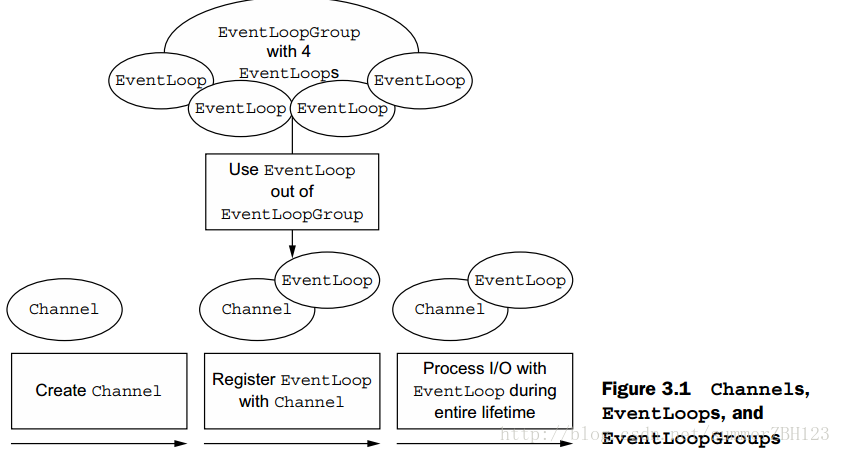
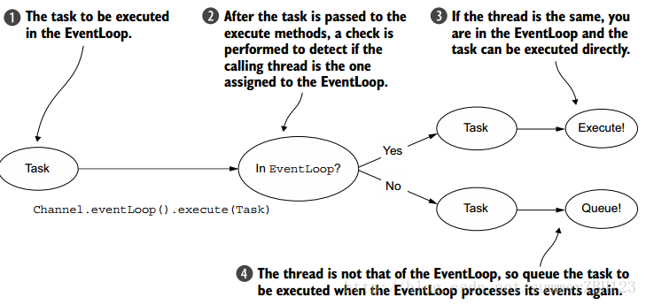

# TCP、UDP的区别
* TCP面向连接,UDP是无连接的，即发送数据之前不需要建立连接
* TCP提供可靠的服务。也就是说，通过TCP连接传送的数据，无差错，不丢失，不重复，且按序到达;UDP尽最大努力交付，即不保证可靠交付
* TCP面向字节流，实际上是TCP把数据看成一连串无结构的字节流;UDP是面向报文的，UDP没有拥塞控制，因此网络出现拥塞不会使源主机的发送速率降低
* 每一条TCP连接只能是点到点的;UDP支持一对一，一对多，多对一和多对多的交互通信
* TCP首部开销20字节;UDP的首部开销小，只有8个字节
* TCP的逻辑通信信道是全双工的可靠信道，UDP则是不可靠信道

# TCP协议如何保证可靠传输
TCP通过序列号、检验和、确认应答信号、重发控制、连接管理、窗口控制、流量控制、拥塞控制实现可靠性
* 应用数据被分割成 TCP 认为最适合发送的数据块。
* TCP 给发送的每一个包进行编号，接收方对数据包进行排序，把有序数据传送给应用层。
* 校验和：TCP 将保持它首部和数据的检验和。这是一个端到端的检验和，目的是检测数据在传输过程中的任何变化。如果收到段的检验和有差错，TCP 将丢弃这个报文段和不确认收到此报文段。
* TCP 的接收端会丢弃重复的数据
* 流量控制： TCP 连接的每一方都有固定大小的缓冲空间，TCP的接收端只允许发送端发送接收端缓冲区能接纳的数据。当接收方来不及处理发送方的数据，能提示发送方降低发送的速率，防止包丢失。TCP 使用的流量控制协议是可变大小的滑动窗口协议。 （TCP 利用滑动窗口实现流量控制）
* 拥塞控制： 当网络拥塞时，减少数据的发送
* 停止等待协议: 也是为了实现可靠传输的，它的基本原理就是每发完一个分组就- 停止发送，等待对方确认。在收到确认后再发下一个分组。 超时重传： 当 TCP 发出一个段后，它启动一个定时器，等待目的端确认收到这个报文段。如果不能及时收到一个确认，将重发这个报文段

# TCP的握手、挥手机制

### 三次握手

* 第一次握手：起初两端都处于CLOSED关闭状态，Client将标志位SYN置为1，随机产生一个值seq=x，并将该数据包发送给Server，Client进入SYN-SENT状态，等待Server确认
* 第二次握手：Server收到数据包后由标志位SYN=1得知Client请求建立连接，Server将标志位SYN和ACK都置为1，ack=x+1，随机产生一个值seq=y，并将该数据包发送给Client以确认连接请求，Server进入SYN-RCVD状态，此时操作系统为该TCP连接分配TCP缓存和变量；
* 第三次握手：Client收到确认后，检查ack是否为x+1，ACK是否为1，如果正确则将标志位ACK置为1，ack=y+1，并且此时操作系统为该TCP连接分配TCP缓存和变量，并将该数据包发送给Server，Server检查ack是否为y+1，ACK是否为1，如果正确则连接建立成功，Client和Server进入ESTABLISHED状态，完成三次握手，随后Client和Server就可以开始传输数据

### 四次挥手
* Client向Server发送断开连接请求的报文段，seq=m(m为Client最后一次向Server发送报文段的最后一个字节序号加1)，Client进入FIN-WAIT-1状态
* Server收到断开报文段后，向Client发送确认报文段，seq=n(n为Server最后一次向Client发送报文段的最后一个字节序号加1)，ack=m+1，Server进入CLOSE-WAIT状态。此时这个TCP连接处于半开半闭状态，Server发送数据的话，Client仍然可以接收到
* Server向Client发送断开确认报文段，seq=u(u为半开半闭状态下Server最后一次向Client发送报文段的最后一个字节序号加1)，ack=m+1，Server进入LAST-ACK状态
* Client收到Server的断开确认报文段后，向Server发送确认断开报文，seq=m+1，ack=u+1，Client进入TIME-WAIT状态。
* Server收到Client的确认断开报文，进入CLOSED状态，断开了TCP连接

# TCP的粘包/拆包原因及其解决方法是什么

## 粘包/拆包的原因

* 要发送的数据大于TCP发送缓冲区剩余空间大小，将会发生拆包，缓冲区由MTU来控制
* 待发送数据大于MSS（最大报文长度），TCP在传输前将进行拆包
* 要发送的数据小于TCP发送缓冲区的大小，TCP将多次写入缓冲区的数据一次发送出去，将会发生粘包
* 接收数据端的应用层没有及时读取接收缓冲区中的数据，将发生粘包

## 解决办法

* 发送端给每个数据包添加包首部，首部中应该至少包含数据包的长度，这样接收端在接收到数据后，通过读取包首部的长度字段，便知道每一个数据包的实际长度了
* 发送端将每个数据包封装为固定长度（不够的可以通过补0填充），这样接收端每次从接收缓冲区中读取固定长度的数据就自然而然的把每个数据包拆分开来
* 可以在数据包之间设置边界，如添加特殊符号，这样，接收端通过这个边界就可以将不同的数据包拆分开

# Netty的粘包/拆包是怎么处理的，有哪些实现

* 消息定长 FixedLengthFrameDecoder
* 行分隔符类 LineBasedFrameDecoder
* 将消息分为消息头和消息体 LengthFieldBasedFrameDecoder类。分为有头部的拆包与粘包、长度字段在前且有头部的拆包与粘包、多扩展头部的拆包与粘包

# 同步与异步、阻塞与非阻塞的区别

同步与异步的区别：在于是否开启新的线程
阻塞于非阻塞的区别：当前线程是否挂起，即是否释放CPU

同步：执行一个操作之后，等待结果，然后才继续执行后续的操作。
异步：执行一个操作后，可以去执行其他的操作，然后等待通知再回来执行刚才没执行完的操作
阻塞：进程给CPU传达一个任务之后，一直等待CPU处理完成，然后才执行后面的操作
非阻塞：进程给CPU传达任务后，继续处理后续的操作，隔断时间再来询问之前的操作是否完成。这样的过程其实也叫轮询。

# 说说网络IO模型

* 阻塞IO（blocking IO）

  当用户进程调用了recvfrom这个系统调用，kernel就开始了IO的第一个阶段：准备数据。对于network io来说，很多时候数据在一开始还没有到达（比如，还没有收到一个完整的UDP包），这个时候kernel就要等待足够的数据到来。而在用户进程这边，整个进程会被阻塞。当kernel一直等到数据准备好了，它就会将数据从kernel中拷贝到用户内存，然后kernel返回结果，用户进程才解除block的状态，重新运行起来
  
* 非阻塞IO（non-blocking IO

  当用户进程发出read操作时，如果kernel中的数据还没有准备好，那么它并不会block用户进程，而是立刻返回一个error。从用户进程角度讲 ，它发起一个read操作后，并不需要等待，而是马上就得到了一个结果。用户进程判断结果是一个error时，它就知道数据还没有准备好，于是它可以再次发送read操作。一旦kernel中的数据准备好了，并且又再次收到了用户进程的system call，那么它马上就将数据拷贝到了用户内存，然后返回
  
* 多路复用IO（IO multiplexing）

  当用户进程调用了select，那么整个进程会被block，而同时，kernel会“监视”所有select负责的socket，当任何一个socket中的数据准备好了，select就会返回。这个时候用户进程再调用read操作，将数据从kernel拷贝到用户进程。
  和blocking IO的图其实并没有太大的不同，事实上还更差一些。因为这里需要使用两个系统调用(select和recvfrom)，而blocking IO只调用了一个系统调用(recvfrom)。但是，用select的优势在于它可以同时处理多个connection。（多说一句：所以，如果处理的连接数不是很高的话，使用select/epoll的web server不一定比使用multi-threading + blocking IO的web server性能更好，可能延迟还更大。select/epoll的优势并不是对于单个连接能处理得更快，而是在于能处理更多的连接。）
    在多路复用模型中，对于每一个socket，一般都设置成为non-blocking，但是，如上图所示，整个用户的process其实是一直被block的。只不过process是被select这个函数block，而不是被socket IO给block。因此select()与非阻塞IO类似。

* 异步IO（Asynchronous I/O）

   用户进程发起read操作之后，立刻就可以开始去做其它的事。而另一方面，从kernel的角度，当它受到一个asynchronous read之后，首先它会立刻返回，所以不会对用户进程产生任何block。然后，kernel会等待数据准备完成，然后将数据拷贝到用户内存，当这一切都完成之后，kernel会给用户进程发送一个signal，告诉它read操作完成了。
   
# BIO、NIO、AIO分别是什么

* 同步阻塞的BIO
   在JDK1.4出来之前，我们建立网络连接的时候采用BIO模式，需要先在服务端启动一个ServerSocket，然后在客户端启动Socket来对服务端进行通信，默认情况下服务端需要对每个请求建立一堆线程等待请求，而客户端发送请求后，先咨询服务端是否有线程相应，如果没有则会一直等待或者遭到拒绝请求，如果有的话，客户端会线程会等待请求结束后才继续执
   
* 同步非阻塞的NIO
   NIO本身是基于事件驱动思想来完成的，其主要想解决的是BIO的大并发问题： 在使用同步I/O的网络应用中，如果要同时处理多个客户端请求，或是在客户端要同时和多个服务器进行通讯，就必须使用多线程来处理。也就是说，将每一个客户端请求分配给一个线程来单独处理。这样做虽然可以达到我们的要求，但同时又会带来另外一个问题。由于每创建一个线程，就要为这个线程分配一定的内存空间（也叫工作存储器），而且操作系统本身也对线程的总数有一定的限制。如果客户端的请求过多，服务端程序可能会因为不堪重负而拒绝客户端的请求，甚至服务器可能会因此而瘫痪。

   NIO基于Reactor，当socket有流可读或可写入socket时，操作系统会相应的通知引用程序进行处理，应用再将流读取到缓冲区或写入操作系统。  也就是说，这个时候，已经不是一个连接就要对应一个处理线程了，而是有效的请求，对应一个线程，当连接没有数据时，是没有工作线程来处理的。

   BIO与NIO一个比较重要的不同，是我们使用BIO的时候往往会引入多线程，每个连接一个单独的线程；而NIO则是使用单线程或者只使用少量的多线程，每个连接共用一个线程
   
* 异步非阻塞的AIO
   与NIO不同，当进行读写操作时，只须直接调用API的read或write方法即可。这两种方法均为异步的，对于读操作而言，当有流可读取时，操作系统会将可读的流传入read方法的缓冲区，并通知应用程序；对于写操作而言，当操作系统将write方法传递的流写入完毕时，操作系统主动通知应用程序。  即可以理解为，read/write方法都是异步的，完成后会主动调用回调函数
   
   
# select、poll、epoll的机制及其区别

select，poll，epoll都是IO多路复用的机制。I/O多路复用就通过一种机制，可以监视多个描述符，一旦某个描述符就绪（一般是读就绪或者写就绪），能够通知程序进行相应的读写操作
但select，poll，epoll本质上都是同步I/O，因为他们都需要在读写事件就绪后自己负责进行读写，也就是说这个读写过程是阻塞的，而异步I/O则无需自己负责进行读写，异步I/O的实现会负责把数据从内核拷贝到用户空间

* select: select系统调用的用途是：在一段指定时间内，监听用户所感兴趣的文件描述符上的可读、可写和异常事件

* poll : poll系统调用和select类似，也是在制定时间内轮询一定数量的文件描述符，以测试其中是否有就绪的文件描述符

* epoll
   1: 使用一组函数来完成，而不是单个
   2: 把用户关心的文件描述符上的事件放在内核的一个事件表中，无须向select、poll那样每次调用都要重复传入文件描述符集或事件集，但epoll需要用一个额外的文件描述符来表示内核中的这个事件表
   
# 说说你对Netty的了解
  
# Netty跟Java NIO有什么不同，为什么不直接使用JDK NIO类库

## NIO与Netty的区别：

* NIO的类库和API繁杂，使用麻烦，你需要熟练掌握Selector,ServerSocketChannel、SocketChannel、ByteBuffer等。
* 需要具备其他的额外技能做铺垫，例如熟悉Java多线程编程。这是因为NIO编程涉及到Reactor模式，你必须对多线程和网络编程非常熟悉，才能写出高质量的NIO程序。
* 可靠性能力补齐，工作量和难度非常大。例如客户端面临断连重连、网络闪断、半包读写、失败缓存、网络拥塞和异常码流的处理等问题，NIO编程的特点是功能开发相对容易，但是可靠性能力补齐的工作量和难度都非常大。
* JDK NIO的BUG,例如epoll bug，它会导致Selector空轮询，最终导致CPU 100%。官方验证例子 基于以上原因，在大多数场景下，不建议直接使用JDK的NIO类库，除非你精通NIO编程或者有特殊的需求。在绝大多数的业务场景中，我们可以使用NIO框架Netty来进行NIO编程，它既可以作为客户端也可以作为服务端，同时支持UDP和异步文件传输，功能非常强大。

## 使用Netty的理由
* API使用简单，开发门槛低
* 功能强大，预置了多种编解码功能，支持多种主流协议
* 定制能力强，可以通过ChannelHandler对通信框架进行灵活地扩展
* 性能高，通过与其他业界主流的NIO框架对比，Netty的综合性能最优
* 成熟、稳定，Netty修复了已经发现的所有JDK NIO BUG，业务开发人员不需要再为NIO的BUG而烦恼
* 社区活跃，版本迭代周期短，发现的BUG可以被及时修复，同时，更多的新功能会加入
* 经历了大规模的商业应用考验，质量得到验证。在互联网、大数据、网络游戏、企业应用、电信软件等众多行业得到成功商用，证明了它已经完全能够满足不同行业的商业应用了。

# Netty组件有哪些，分别有什么关联

* Channel  ----Socket
* EventLoop ----控制流，多线程处理，并发；
* ChannelHandler和ChannelPipeline
* Bootstrap 和 ServerBootstrap

## Channel 接口
   基本的I/O操作，在基于java 的网络编程中，其基本的构造是 Socket，在jdk中channel是通讯载体，在netty中channel被赋予了更多的功能
用户可以有一下四类操作：
* 查询channel状态
* 配置channel参数
* 进行channel支持的I/O操作（read,write,connect,bind）
* 获取channel对应的ChannelPipeline, 从而自定义处理I/O事件和其他请求

## EventLoop 接口
   EventLoop 是用来处理连接的生命周期中所发生的事情，EventLoop, channel, Thread 以及 EventLoopGroup 之间的关系如下图
    
   这几个组件之间的关系总结下就是
* 一个 EventLoopGroup 包含多个 EventLoop
* 一个 EventLoop 在他的生命周期中只和一个 Thread 绑定
* 所有的 EventLoop 处理的 I/O 事件都将在专有的 Thread 上处理
* 一个 Channel 在他的生命周期中只会注册一个 EventLoop
* 一个 EventLoop 会被分配给多个 Channel; 

## EventLoop 的线程管理
   如果当前调用的线程正是支撑 EventLoop 的线程，那么所提交的代码将会直接执行(这里可以调用 inEventLoop 或者是 inEventLoop(Thread thread ) 方法)，否则，EventLoop 将调度该任务以便稍后执行，并将它放入到内部队列中去。当 EventLoop 下次处理他的事件时，它将会执行队列中的那些任务/事件。这也解释了任何的 Thread 是如何与 Channel 直接交互而无需在 ChannelHandler 中进行额外同步的。
   注：每个 EventLoop 都有它自己的任务队列，独立于任何其他的 EventLoop 
   
  异步传输的实现：异步传输使用了少量的 EventLoop ,而且在当前的线程模型中，它可能被多个 channel 所共享。这样就尽可能少的 Thread 来支撑大量的 Channel 

EventLoopGroup 为每个新创建的 Channel 分配一个 EventLoop。相同的 EventLoop 可能会被分配给多个 Channel 。一旦一个 Channel 分配给一个 EventLoop, 它将在你整个生命周期中都使用这个 EventLoop (以及其关联的 Thread )。这样就可以解释为什么 ChannelHandler 是线程安全的

注：对于BIO 这样的传输方式可能和 NIO 有所不同，每个 Channel 都将分配给一个 EventLoop (以及对应的 Thread )。其模型是：一个 EventLoopGroup 对应多一个 EventLoop ,一个 EventLoop 对应一个 Channel 。

注意, 因为 EventLoop 既需要执行 IO 操作, 又需要执行 task, 因此我们在调用 EventLoop.execute 方法提交任务时, 不要提交耗时任务, 更不能提交一些会造成阻塞的任务, 不然会导致我们的 IO 线程得不到调度, 影响整个程序的并发量.

## ChannelHandler 接口

ChannelHandler 充当了所有处理入站和出站数据的应用程序逻辑的容器。
ChannelHandler 的生命周期主要指的是 handler 添加到 ChannelPipeline 中，handler 从pipeline 中移除

## ChannelPipeline 接口
ChannelPipeline 为 ChannelHandler 链提供了容器，当 channel 创建时，就会被自动分配到它专属的 ChannelPipeline ，这个关联是永久性的。

   ChannelHandler 添加到 ChannlePipeline 的过程
* 一个 ChannelInitializer 的实现被注册到 ServerBootstrop 当中
* 当 ChannelInitializer.initChannel() 方法被调用时，ChannelInitializer 将在 ChannelPipeline 中安装一组自定义的 ChannelHandler
* ChannelInitializer 将他自己从 ChannelPipeline 中移除；

当 ChannelHandler 被添加到 ChannelPipeline 时，会被分配一个 ChannelHandlerContext ,代表的是 ChannelHandler 和 ChannelPipeline 之间的绑定。

## ChannelHandlerContext 接口

ChannelHandlerContext 主要是用来管理它所关联的 ChannelHandler 和在同一个 ChannlePipeline 中其他的 ChannelHandler 之间的交互

## Bootstrap 和 ServerBootstrap
 Bootstrap 和 ServerBootstrap 这两个引导类分别是用来处理客户端和服务端的信息，服务器端的引导一个父 Channel 用来接收客户端的连接，一个子 Channel 用来处理客户端和服务器端之间的通信，客户端则只需要一个单独的、没有父 Channel 的 Channel 来去处理所有的网络交互（或者是无连接的传输协议，如 UDP）

# 说说Netty的执行流程
